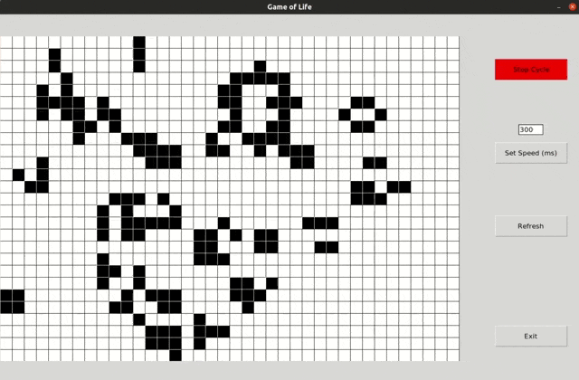

# Conway's Game of Life

It's a cellular automaton.

Just create an initial configuration and observe how it evolves.

More information about the process on [Wikipedia](https://en.wikipedia.org/wiki/Conway's_Game_of_Life).

&nbsp;
To play, run ***main.py***


&nbsp;

---

## ⚙️ Technologies employed   
   
\
 **tkinter**
: the standard Python interface to the Tk GUI toolkit. See [Docs](https://wiki.python.org/moin/TkInter).

 **NumPy**
: the fundamental package for scientific computing in Python. See [Docs](https://numpy.org/doc/1.22/index.html).

&nbsp;

>If not installed yet, run:
>
>- using pip :
>```
>pip install python-tk
>```
>```
>pip install numpy
>```
>For python 3 :
>```
>pip install python3-tk
>```
>```
>pip3 install numpy
>```
>- on Linux :
>```
>sudo apt-get install python-tk
>```
>```
>sudo apt-get install python-numpy
>```
>For python 3 :
>```
>sudo apt-get install python3-tk
>```
>```
>sudo apt-get install python3-numpy
>```

&nbsp;

## ⚠️ Anything went wrong ?
&nbsp;
- The *tkinter* module is not the same depending on your Python version. 

If you get this while running the script:
```
ImportError: No module named 'Tkinter'
```
or
```
ImportError: No module named 'tkinter'
```
then try this changes inside the code

| Python 2     | Python 3     |
|--------------|--------------|
|Tkinter       | tkinter      |
|MessageBox    | messagebox   |

&nbsp;
- If NumPy installation fails with this message:
```
IMPORTANT: PLEASE READ THIS FOR ADVICE ON HOW TO SOLVE THIS ISSUE!

Importing the numpy c-extensions failed. This error can happen for
different reasons, often due to issues with your setup.
```
then see [Troubleshooting ImportError](https://numpy.org/doc/stable/user/troubleshooting-importerror.html).
  
&nbsp;

---

## 🏷️ License
\
&copy; 2022 Yacine BOUKARI

This application is under MIT License.


Read the [LICENSE](LICENSE) for further details.

